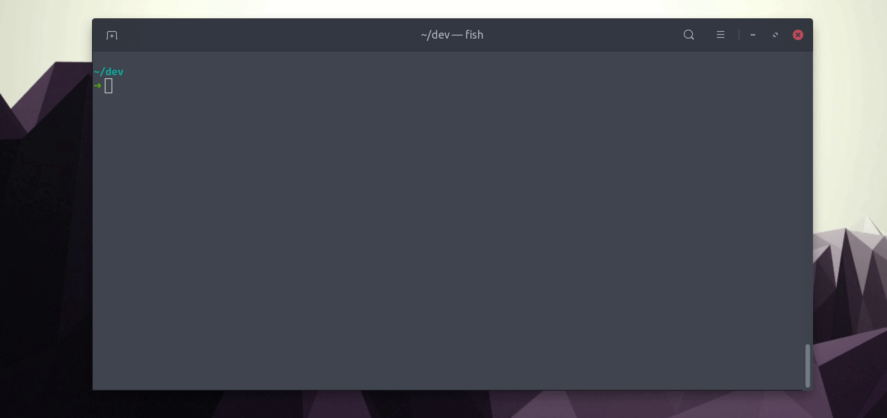

# Blocktober

<!-- ALL-CONTRIBUTORS-BADGE:START - Do not remove or modify this section -->

[](#contributors-)

<!-- ALL-CONTRIBUTORS-BADGE:END -->

**Let your repo cool down, and block the hacktoberfest spammers**



Tired of the hacktober spamming? `blocktober` brings your repo back rest.

## Usage

Limit interactions on an entire org:

```shell
npx blocktober {org} {level}
```

Limit interactions on a single repo:

```shell
npx blocktober {owner}/{repo} {level}
```

Show active restrictions

```shell
npx blocktober {org}
npx blocktober {owner}/{repo}
```

Clear all restrictions

```shell
npx blocktober {org} clear
npx blocktober {owner}/{repo} clear
```

## Interaction Levels

The levels correspond to those that are available trough github settings. Blocktober uses partial matching for the levels. So there is no need to type them out full. `us` would be enough for users, `cont` for contributors and `col` for collaborators.

| level         | description                                                                                                                |
| ------------- | -------------------------------------------------------------------------------------------------------------------------- |
| users         | Users that have recently created their account will be unable to interact with the repository.                             |
| contributors  | Users that have not previously committed to the repository’s master branch will be unable to interact with the repository. |
| collaborators | Only users who have been granted write access, or are collaborators, will be able to interact with the repository.         |

## Contributors ✨

Thanks goes to these wonderful people ([emoji key](https://allcontributors.org/docs/en/emoji-key)):

<!-- ALL-CONTRIBUTORS-LIST:START - Do not remove or modify this section -->
<!-- prettier-ignore-start -->
<!-- markdownlint-disable -->
<table>
  <tr>
    <td align="center"><a href="https://github.com/smeijer"><br /><sub><b>Stephan Meijer</b></sub></a><br /><a href="#ideas-smeijer" title="Ideas, Planning, & Feedback">🤔</a> <a href="https://github.com/smeijer/blocktober/commits?author=smeijer" title="Code">💻</a> <a href="#infra-smeijer" title="Infrastructure (Hosting, Build-Tools, etc)">🚇</a> <a href="#maintenance-smeijer" title="Maintenance">🚧</a></td>
  </tr>
</table>

<!-- markdownlint-enable -->
<!-- prettier-ignore-end -->

<!-- ALL-CONTRIBUTORS-LIST:END -->

This project follows the [all-contributors](https://github.com/all-contributors/all-contributors) specification. Contributions of any kind welcome!
